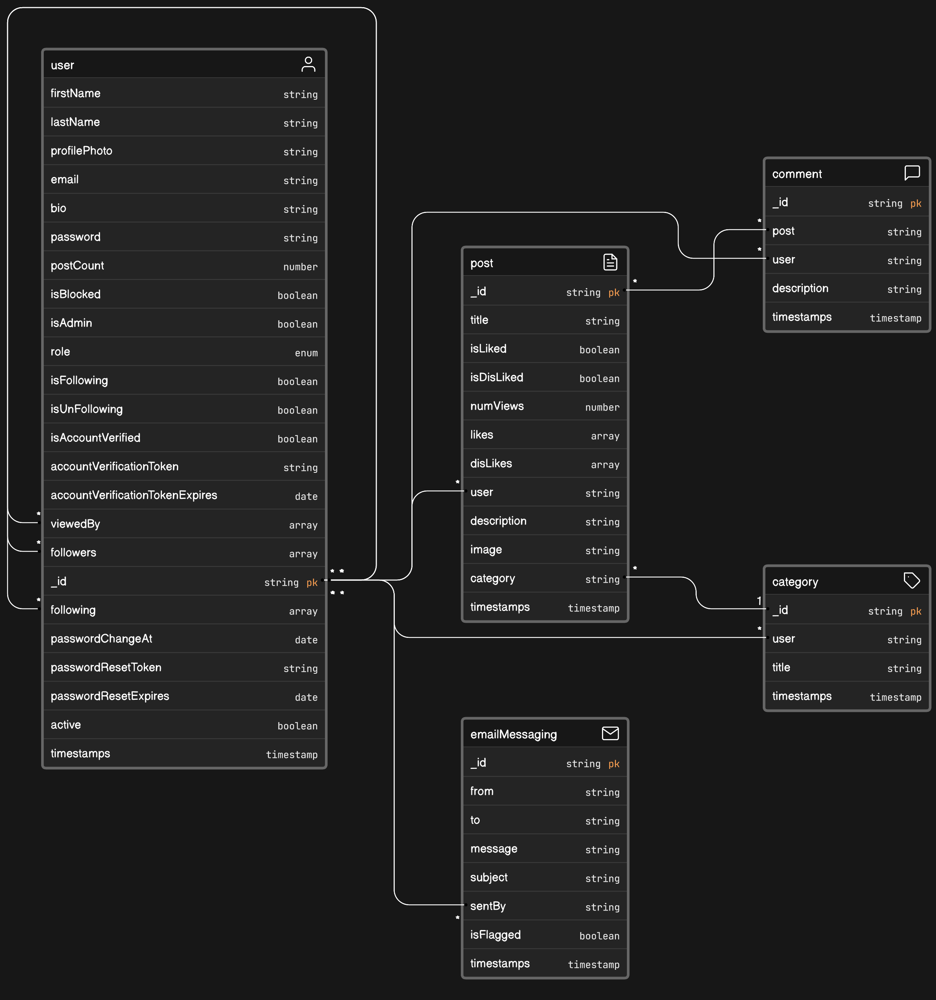

# WellNest

# Database Structure



## Relations:

1. **User and Post:** One-to-many relationship. A user can have multiple posts, but each post is created by one user.

2. **User and Email:** One-to-many relationship. A user can send multiple emails, but each email is sent by one user.

3. **User and Comment:** One-to-many relationship. A user can have multiple comments, but each comment is made by one user.

4. **Post and Comment:** One-to-many relationship. A post can have multiple comments, but each comment refers to one post.

5. **User and Category:** One-to-many relationship. A user can create multiple categories, but each category is created by one user.

6. **Post and Category:** Many-to-one relationship. Each post belongs to one category, but a category can have multiple posts.

7. **User and User (viewedBy, followers, following):** Many-to-many relationship through self-referencing. A user can be followed by multiple users and can follow multiple users.

# Technology

- [Express](https://expressjs.com/en/starter/installing.html)
- [Nodemon](https://www.npmjs.com/package/nodemon)
- [Mongoose](https://mongoosejs.com/docs/guide.html)
- [Dotenv](https://www.npmjs.com/package/dotenv)
- [Bcryptjs](https://www.npmjs.com/package/bcryptjs)
- [Nodemailer](https://nodemailer.com/)
- [Express Async Handler](https://www.npmjs.com/package/express-async-handler)
- [Jsonwebtoken](https://www.npmjs.com/package/jsonwebtoken)
- [Cors](https://www.npmjs.com/package/cors)
- [Bad Words](https://www.npmjs.com/package/bad-words)
- [Sharp](https://www.npmjs.com/package/sharp)
- [Multer](https://www.npmjs.com/package/multer)
- [Cloudinary](https://www.npmjs.com/package/cloudinary)

## API Request

### User API

`POST User API`

**POST**

```
/api/users/register
```

**`Request`**

```
{
    "firstName": "String",
    "lastName": "String",
    "email": "String",
    "password": "String"
}
```

**POST**

```
/api/users/login
```

**`Request`**

```
{
    "email": "String",
    "password": "String"
}
```

**GET**

```
/api/users/profile/:userId
```

**`Headers`**

```
Authorization: Bearer <token>
```

**PUT**

```
/api/users/update/:userId
```

**`Headers`**

```
Authorization: Bearer <token>
```

**`Request`**

```
{
    "firstName": "String",
    "lastName": "String",
    "email": "String",
    "bio": "String"
}
```

**DELETE**

```
/api/users/delete/:userId
```

**PUT**

```
/api/users/follow/:userId
```

**`Headers`**

```
Bearer <token>
```

**`Request`**

```
{
    "followId": "String"
}
```

**PUT**

```
/api/users/unfollow/:userId
```

**`Headers`**

```
Bearer <token>
```

**`Request`**

```
{
    "unFollowId": "String"
}
```

**PUT**

```
/api/users/block-user/:userId
```

**`Headers`**

```
Bearer <token>
```

**`Request`**

```
{
    "isBlocked": "String"
}
```

**PUT**

```
/api/users/unblock-user/:userId
```

**`Headers`**

```
Bearer <token>
```

**`Request`**

```
{
    "isBlocked": "String"
}
```

**POST**

```
/api/users/forget-password-token
```

**`Headers`**

```
Bearer <token>
```

**`Request`**

```
{
    "email": "String"
}
```

**PUT**

```
/api/users/password
```

**`Headers`**

```
Bearer <token>
```

**`Request`**

```
{
    "password": "String"
}
```

**POST**

```
/api/users/generate-verify-email-token
```

**`Headers`**

```
Bearer <token>
```

**PUT**

```
/api/users/verify-account
```

**`Headers`**

```
Bearer <token>
```

**`Request`**

```
{
    "token": "String"
}
```

**GET**

```
/api/users/:userId
```

**PUT**

```
/api/users/reset-password
```

**`Headers`**

```
Bearer <token>
```

**`Request`**

```
{
    "token": "String",
    "password": "String"
}
```

**GET**

```
/api/users/:userId
```

**`Headers`**

```
Bearer <token>
```

**`Request`**

```
{
    "firstName": "String",
    "lastName": "String",
    "email": "String",
    "bio": "String"
}
```

**PUT**

```
/api/users/profilephoto-upload
```

**`Form Data`**

```
    Key: image (file)
    value: image
```

### Email Messaging API

`Send Email API`

**POST**

```
/api/email/
```

**`Headers`**

```
Bearer <token>
```

**`Request`**

```
{
    "to": "String",
    "subject": "String",
    "message": "String"
}
```

## How to Run Locally

Follow these steps to run this API locally:

1. Clone this repository to your local machine.
2. Navigate into the project directory:

```
cd backend
```

3. **Install Dependencies:** Install all necessary dependencies using Yarn. If you don't have Yarn, you can install it by running **`npm install -g yarn`**. After installing Yarn, install the application dependencies:

```
yarn install
```

4. Setup environment variables by creating a .env file in the root directory. It should contain the following:

```
PORT=5000
MONGODB_URL=your_mongodb_url
```

5. Replace your_mongodb_url with your actual MongoDB connection URL.
6. Run the server:

```
yarn dev
```

The server should now be running on:

```
http://localhost:5000.
```
